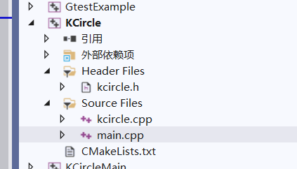
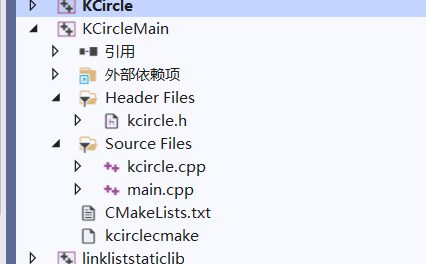
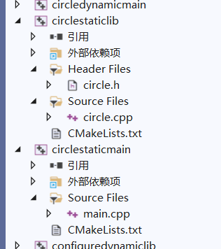
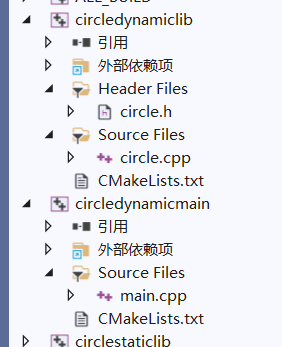
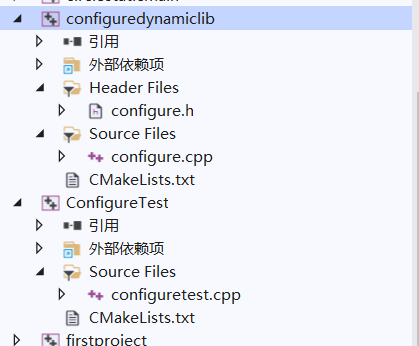
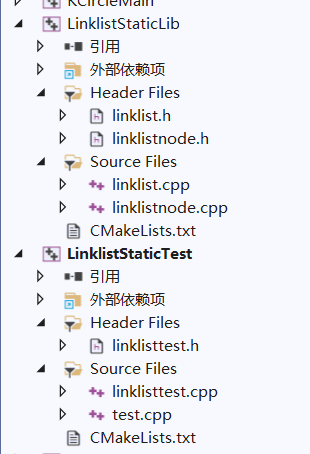
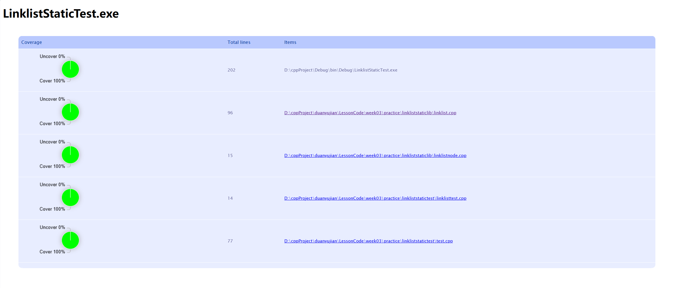

练习一：**（/kcircle）**

1. 大家看懂上面的代码后， 自己写一个KCirlce.h KCicle.cpp main.cpp
2. KCicle类中成员变量定义圆形的半径，成员函数设计求面积和周长
3. main.cpp 定义KCicle对应，调用对应的函数。
4. 大家用CMakeLists.txt来进行工程管理

练习二：**（/kcirclecmake）**

大家自己写个 KCircle.h 何 KCircle.cpp来求圆形的面积和周长来进行改造，改造程xx.cmake的脚本的使用

练习三：**（circlestaticlib 静态库）  （circlestaticlib 外部调用）**

大家把之前写的作业，封装成静态库。 然后再写一个工程调用该库。然后在上传到git上 。

练习四：**（/circledynamiclib   动态库）（/circledynamicmain   外部调用）**

 我们来实验生成一个动态库库。例如:

1. 设计一个circle.h和circle.cpp类，根据用户输入的圆形的半径求圆形的面积和周长。
2. 创建一个ExportCircle类，作为导出类给其他类使用。

然后创建新工程分别写出加载dll的代码

课堂练习五：**（/configuredynamiclib   动态库） （/configuredynamictest   外部调用并测试）**

1. 现设计一个Configure类，用于对字符串进行相关的操作。

1. Configure类中有以下几个成员函数：

1. 1. int  addItem(std::string  str);  TEST--->TEST_F

功能：用于添加一个字符串，并返回字符串下标，若是字符串已经保存过了，返回其在已有容器中的下标

1. 1. std::string  getItem(int index);

功能：根据下标返回对应的字符串，若是下标不合法或越界，返回""

1. 1. int getSize() const

功能： 返回存储字符串的个数

1. Configure中设计成员变量 std::vector<std::string> m_vItems; 保存字符串信息。

1. 自己设计一个单元测试程序，分别设计三个TEST，对上述三个接口进行验证。接口中定义类对象，然后调用对应的成员函数。

练习六：**（/linkliststaticlib  队列静态库） （/linkliststatictest  外部调用测试）**

1. 自己简单写一个linklist类
2. 然后利用test fix对链表类中的函数类接口来进行测试，观察输出结果

练习七：

同学把自己上个题目中的linklist类，单元测试代码。利用OpenCppCoverage来进行单元测试并输出结果。 要求行覆盖率达到100%

