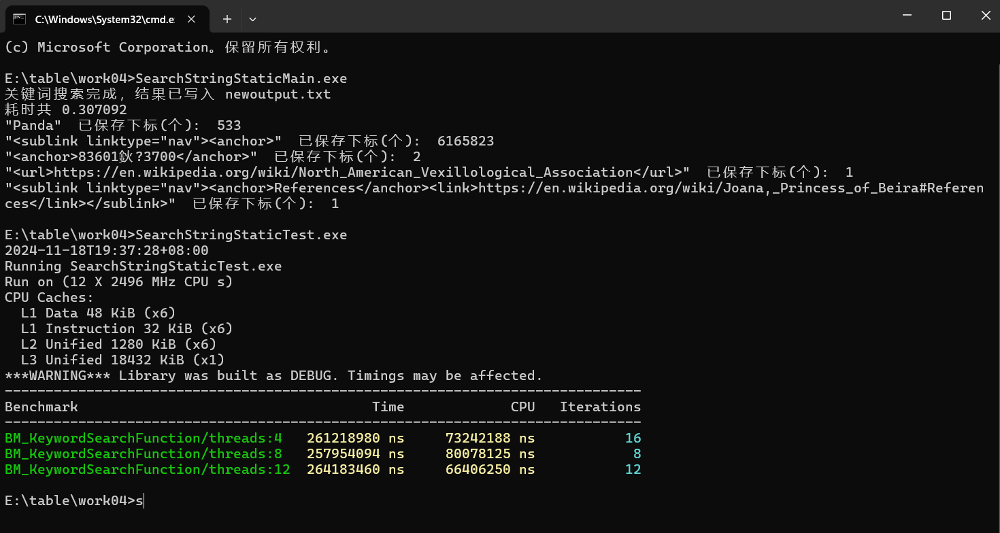
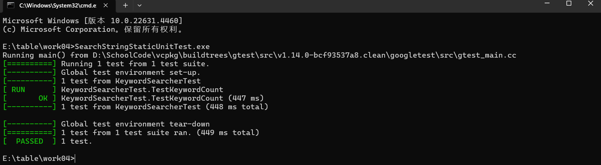

**题目：**

在这里我提供了一个维基百科英文的数据集，文件大小约为1G，文件类型为xml，你们可以把它当成纯文本文件来看待。我们的程序要求是找出下面给定字符串(假定每个被搜索的字符串的长度不超过300)，统计这些词语出现的次数以及位置。计算你的程序统计每个关键词所需时间，并且分析程序性能瓶颈和问题原因。程序不要求有界面，程序启动就读取keyword.txt中的关键词开始搜索，并且将每个关键词的搜索时间输出到output.txt中，每个关键词的匹配位置不要求输出但是要用合适的容器保存。

可能用到的技术：***\*内存映射文件、多线程、线程池、内存池、边界处理 、字符匹配方案\****等。

评判标准：

本次作业的成绩分为几个不同的环节，比如搜索文件，存储结果等，最终成绩以完成整个搜索任务的时间为主，当总搜索时间相差不大的情况下会逐个查看每一部分逻辑的效率的实现来确定排名先后。

得分点（重要程序按先后顺序）：

1. 搜索速度快，结果准确**（搜索并存储位置总时间0.3s）**
2. 有详细的开发文档和完善测试流程和测试结果**（如下）**

1. 编码规范，代码的可读性要高，同时兼顾程序健壮性和稳定性**（遇到极端情况抛出相应异常）**
2. 根据特定场景选择合适的字符串匹配算法**（根据关键字长度调整搜索算法）**

**运行输出与测试（分为4、8、12线程执行）结果：**






**==========================================整体代码思路=============================================**

文件分为：十个文件
　　**searchstringstaticlib文件夹**（cmake可封装成静态库）：keywordresult.h、memorypool.h、memorypool.cpp、threadpool.h、threadpool.cpp、keywordsearcher.h、keywordsearcher.cpp

​		**searchstringstaticmain文件夹**（调用静态库）：main.cpp

​		**searchstringstaticbenchmarktest文件夹**（调用静态库）：test.cpp

​        **searchstringstaticunittest文件夹**（调用静态库）：test.cpp

​        keywordresult.h定义了一个用于关键词搜索结果的**结构体` KeywordResult`**，主要用于存储关键词的相关统计信息，包括关键词本身、出现次数、搜索时间和匹配位置。memorypool.h、memorypool.cpp定义了一个 **内存池类 `MemoryPool`**，用于高效管理动态内存分配，特别是频繁分配和释放内存的场景。通过复用内存块，可以减少动态内存分配的开销，从而提高性能。

​        threadpool.h、threadpool.cpp实现了一个 **线程池类 `ThreadPool`**，用于管理线程的创建、任务的分发与执行。通过线程池，可以高效地复用线程资源，避免频繁创建和销毁线程的开销，适用于多任务并发处理场景。

​		keywordsearcher.h、keywordsearcher.cpp实现了一个 **关键词搜索类 `KeywordSearcher`**，提供文件关键词匹配的功能。它可以并行搜索多个关键词并记录每个关键词的出现次数、位置，以及搜索耗时，最终将结果输出到文件。

​		main.cpp是关键词搜索程序的 **主函数**，主要作用是加载目标文件和关键词文件，准备搜索，执行关键词搜索利用 `KeywordSearcher` 类对目标文件中的关键词进行并行搜索，将搜索结果写入文件，同时打印每个关键词的匹配结果和搜索总耗时。

​		searchstringstaticbenchmarktest/test.cpp是基于 Google Benchmark 的性能测试工具，用于测试 **关键词搜索程序的性能**，分析在不同线程数情况下的运行时间表现。

​		searchstringstaticunittest/test.cpp使用 Google Test 框架编写的单元测试，针对 `KeywordSearcher` 类的功能进行验证。主要目的是确保关键词搜索功能的正确性，包括：**关键词匹配次数是否正确**、**关键词的匹配下标数量是否正确**。

**==================================KeywordResult类设计========================================**

### **结构体字段的功能**

- `std::string m_keyword`：存储搜索的关键词。
- `size_t m_count`：记录关键词在目标文本中出现的次数。
- `double m_searchTime`：记录搜索关键词所花费的时间。
- `std::vector<size_t> m_positionIndexs`：存储关键词在文本中匹配的所有首字符下标。

#### **流程图**

```
+---------------------------------------+
| 定义 KeywordResult 结构体             |
+---------------------------------------+
              |
              v
+---------------------------------------+
| 数据成员初始化                         |
| - m_keyword: 存储关键词字符串          |
| - m_count: 匹配次数                   |
| - m_searchTime: 搜索时间              |
| - m_positionIndexs: 匹配位置下标列表    |
+---------------------------------------+
```

**=======================================MemoryPool类设计====================================**

### **设计思路**

1. **高效分配**：
   - 使用预分配的内存块来减少频繁的动态内存分配操作。
   - 每次分配内存时检查当前块是否有足够的空间，不足则分配新的内存块。
2. **线程安全**：
   - 使用 `std::mutex` 保护分配和重置操作，确保多线程环境下的安全性。
3. **内存复用**：
   - 提供 `reset` 方法，用于重置内存池，释放除第一个块以外的所有块，但保留其内存，从而实现快速复用。
4. **动态扩展**：
   - 当内存需求超过当前块大小时，动态调整内存块大小，按需扩展。
5. **析构函数**：
   - 负责释放所有分配的内存块，避免内存泄漏。

------

### **类成员功能**

#### **公有方法**：

- **`MemoryPool(size_t blockSize)`**：
  - 构造函数，初始化内存池，分配一个初始大小为 `blockSize` 的内存块（默认8MB）。
- **`~MemoryPool()`**：
  - 析构函数，释放所有分配的内存块。
- **`size_t* allocate(size_t numElements)`**：
  - 分配 `numElements` 个 `size_t` 类型的内存，返回指向分配内存的指针。
- **`void reset()`**：
  - 重置内存池，释放除第一个块以外的所有块，重置当前偏移量以实现内存复用。

#### **私有成员**：

- **`std::vector<char*> m_blocks`**：
  - 保存所有内存块的指针，便于管理和释放内存。
- **`size_t m_blockSize`**：
  - 初始内存块大小。
- **`size_t m_currentBlockSize`**：
  - 当前内存块大小，支持动态调整。
- **`size_t m_currentOffset`**：
  - 当前块内的偏移量，指向未使用内存的起始位置。
- **`char* m_currentBlock`**：
  - 当前正在使用的内存块。
- **`std::mutex m_mutex`**：
  - 用于线程安全保护。

------

### **功能流程**

##### **1. 构造函数**

```
+----------------------------------------+
| MemoryPool 构造函数                    |
+----------------------------------------+
              |
              v
+----------------------------------------+
| 初始化内存池：                         |
| - 分配一个初始块                       |
| - 设置块大小为 8MB（默认值）            |
| - 偏移量初始化为 0                     |
+----------------------------------------+
```

##### **2. 内存分配**

```
+----------------------------------------+
| 调用 allocate(numElements)             |
+----------------------------------------+
              |
              v
+----------------------------------------+
| 计算所需内存大小                       |
| - sizeNeeded = numElements * sizeof(size_t) |
+----------------------------------------+
              |
              v
+----------------------------------------+
| 当前块是否足够？                       |
| - 如果不足，分配新块                   |
+----------------------------------------+
              |
              v
+----------------------------------------+
| 返回可用内存地址                       |
+----------------------------------------+
```

##### **3. 重置内存池**

```
+----------------------------------------+
| 调用 reset()                           |
+----------------------------------------+
              |
              v
+----------------------------------------+
| 释放除第一个块以外的所有块             |
| - 保留第一个块                        |
+----------------------------------------+
              |
              v
+----------------------------------------+
| 重置当前块偏移量                       |
+----------------------------------------+
```

#### **分配内存流程**

```
          +----------------------+
          | MemoryPool::allocate |
          +----------+-----------+
                     |
                     v
      +-----------------------------+
      | 计算所需内存大小 sizeNeeded   |
      +-------------+---------------+
                    |
        当前块空间足够？            |
               /       \ 
              /         \ 
      +------+           +--------------------+
      | 是   |           | 分配新块           |
      +------+           +--------------------+
         |                         |
         v                         |
        更新偏移量                   |
         |                         |
         v                         v
	返回指针                更新当前内存块信息
```

**==================================ThreadPool类设计========================================**

### **设计思路**

1. **任务队列**：
   - 使用 `std::queue` 保存待执行的任务。
   - 新任务通过 `enqueue` 方法加入任务队列，线程通过 `std::condition_variable` 等待并获取任务。
2. **线程复用**：
   - 创建固定数量的线程（根据 `numThreads` 参数），这些线程始终运行，在任务队列中有任务时执行任务，没有任务时进入等待状态。
3. **线程同步**：
   - 使用 `std::mutex` 和 `std::condition_variable` 确保任务队列的线程安全，并实现线程的同步与唤醒。
4. **停止机制**：
   - 设置一个 `m_stop` 标志，用于安全地停止线程池的运行，避免线程在未完成任务时直接被销毁。

------

### **类成员功能**

#### **公有方法**：

- **`ThreadPool(size_t numThreads)`**：
  - 构造函数，初始化线程池，启动 `numThreads` 个线程，并将它们加入到 `m_workers` 中。
  - 线程进入循环状态，随时准备执行任务。
- **`~ThreadPool()`**：
  - 析构函数，设置停止标志 `m_stop` 为 `true`，并唤醒所有线程，等待所有线程完成任务后销毁。
- **`void enqueue(std::function<void()> task)`**：
  - 向任务队列中添加任务，任务为一个通用的无返回值函数。
  - 唤醒一个线程执行任务。

#### **私有成员**：

- **`std::vector<std::thread> m_workers`**：
  - 存储线程对象，每个线程在后台循环等待任务。
- **`std::queue<std::function<void()>> m_tasks`**：
  - 保存任务队列，任务为 `std::function<void()>` 类型，支持多种函数对象。
- **`std::mutex m_queueMutex`**：
  - 用于保护任务队列 `m_tasks` 的线程安全。
- **`std::condition_variable m_condition`**：
  - 条件变量，用于线程间的同步。线程等待任务时挂起，通过条件变量被唤醒。
- **`bool m_stop`**：
  - 停止标志，用于安全关闭线程池。

------

### **功能流程**

#### **1. 线程池构造流程**

```
启动 ThreadPool(numThreads)
    |
    v
设置 m_stop = false（初始化停止标志为 false）
    |
    v
对于每个线程（从 0 到 numThreads-1）：
    |
    v
创建一个线程并将其存储到 m_workers 中
    |
    v
每个线程进入无限循环：
    - 等待任务或停止信号
    - 如果有任务，执行任务
    - 如果收到停止信号且任务队列为空，退出循环
    |
    v
所有线程已准备好处理任务
```

#### **2. 任务分发流程**

```
启动 enqueue(task)
    |
    v
使用 m_queueMutex 锁定任务队列
    |
    v
将任务添加到 m_tasks 队列中
    |
    v
释放互斥锁
    |
    v
通知一个线程（唤醒线程）
```

#### **3. 线程执行流程**

```
线程启动
    |
    v
等待任务或停止信号
    |
    v
收到停止信号且任务队列为空？
    |  
    |-- 是 --> 退出线程循环
    |
    |-- 否 --> 从任务队列中取出任务
                   |
                   v
              执行任务
                   |
                   v
        返回等待下一个任务
```

#### **4. 线程池析构流程**

```
启动 ~ThreadPool()
    |
    v
设置 m_stop = true（更新停止标志）
    |
    v
通知所有线程
    |
    v
等待所有线程完成任务（join）
    |
    v
销毁 ThreadPool 对象
```

------

### **流程图**

#### **任务执行线程工作流程**

```
+-------------------+
| 线程启动           |
+-------------------+
          |
          v
+-------------------------------+
| 等待任务或停止信号               |
+-------------------------------+
          |
   +------+------+
   |             |
   v             v
+-----------------------+    +------------------+
| 从任务队列中获取任务     |     | 停止信号？        |
+-----------------------+    +------------------+
          |                     |
          v                     v
+-------------------+     +------------+
| 执行任务           |     | 退出线程     |
+-------------------+     +------------+
          |
          v
+---------------------+
| 返回等待任务状态       |
+---------------------+
```

**==================================KeywordSearcher类设计=================================**

### **设计思路**

1. **模块化设计**：
   - 整合内存池 (`MemoryPool`)、线程池 (`ThreadPool`) 和高效搜索算法（`Boyer-Moore-Horspool`），优化大规模文件关键词搜索。
   - 将文件映射到内存中，避免重复读取文件。
2. **并行计算**：
   - 使用线程池实现并行任务分发，将文件分块后分配给多个线程处理，提高性能。
   - 结合 `std::promise` 和 `std::future` 进行任务结果汇总。
3. **内存优化**：
   - 使用内存池管理关键词匹配位置数组，减少动态内存分配次数。
   - `std::string_view` 避免了内存拷贝，提高处理效率。
4. **适应性**：
   - 根据关键词长度选择不同的匹配算法：
     - 短关键词：直接使用 `std::string_view::find`。
     - 长关键词：使用 `Boyer-Moore-Horspool` 算法。

------

### **类成员功能**

#### **公有方法**：

- **`KeywordSearcher(const std::string& filepath, const std::string& keywordFile)`**：
  - 构造函数，初始化文件路径和关键词文件路径。
  - 加载关键词列表，并将文件映射到内存中。
- **`~KeywordSearcher()`**：
  - 析构函数，释放文件映射内存。
- **`void search()`**：
  - 搜索主函数，利用线程池分块并行处理文件，统计每个关键词的出现位置和次数。
- **`void writeResults(const std::string& outputFile)`**：
  - 将搜索结果写入指定的输出文件。
- **`std::unordered_map<std::string, KeywordResult> getResults()`**：
  - 获取搜索结果，便于进一步分析或直接访问。

#### **私有方法**：

- **`void mapFileToMemory()`**：
  - 将文件映射到内存，提高大文件处理效率。
- **`void loadKeywords(const std::string& keywordFile)`**：
  - 从关键词文件中读取待搜索的关键词列表。
- **`void countKeywordInBlock(...)`**：
  - 使用 `std::string_view::find` 搜索短关键词，适用于小文件或短关键词场景。
- **`void searchKeywordBoyerMooreHorspool(...)`**：
  - 使用 `Boyer-Moore-Horspool` 算法进行长关键词匹配，适合大文件或长关键词场景。

------

### **功能流程**

#### **1. 初始化与文件加载**

```
启动 KeywordSearcher(filepath, keywordFile)
    |
    v
从 keywordFile 加载关键词列表 -> 存储到 m_keywords
    |
    v
将文件映射到内存 -> 生成 m_fileData 和 m_fileSize
    |
    结束
```

#### **2. 搜索流程**

```
启动 search()
    |
    v
对于 m_keywords 中的每个关键词：
    - 选择搜索算法（短关键词/长关键词）
    - 根据线程数量将文件分块
    - 使用线程池对每个文件块进行搜索
    - 汇总结果（匹配次数和位置）
    |
    v
将结果存储到 m_results
    |
    结束
```

#### **3. 写入结果**

```
启动 writeResults(outputFile)
    |
    v
打开输出文件
    |
    v
对于 m_results 中的每个结果：
    - 将关键词、匹配次数和搜索时间写入文件
    |
    v
关闭文件
    |
    结束
```

#### **4. 搜索算法选择**

- 短关键词

  - 使用 `std::string_view::find`，简单高效。

- 长关键词

  - 使用 `Boyer-Moore-Horspool`，降低比较次数。

------

### **关键点和优化**

1. **内存映射**：
   - 通过 `MapViewOfFile` 将文件映射到内存，避免多次 IO 读取，提高处理效率。
   - 使用 `std::string_view` 直接在内存中操作，无需额外拷贝。
2. **多线程并发**：
   - 使用 `ThreadPool` 分配任务，充分利用多核 CPU 的计算能力。
   - 分块时考虑关键词长度，避免跨块漏检或重复检测。
3. **内存池**：
   - 使用 `MemoryPool` 管理关键词位置数组的内存，减少动态分配的性能开销。
4. **算法优化**：
   - 对短关键词直接采用 `std::string_view::find`，快速简单。
   - 长关键词采用 `Boyer-Moore-Horspool`，减少比较次数，优化搜索速度。
5. **异常处理**：
   - 在内存分配、文件操作等关键位置加入异常处理，确保代码健壮性。

------

### **流程图**

#### **1. 搜索流程**

```
+----------------------------------------+
| 开始 KeywordSearcher                    |
+----------------------------------------+
                  |
                  v
+----------------------------------------+
| 从关键词文件加载关键词列表                 |
+----------------------------------------+
                  |
                  v
+----------------------------------------+
| 将目标文件映射到内存                      |
+----------------------------------------+
                  |
                  v
+----------------------------------------+
| 对每个关键词:                            |
| - 分块文件                              |
| - 分配任务给线程                         |
+----------------------------------------+
                  |
                  v
+----------------------------------------+
| 汇总结果                                |
+----------------------------------------+
                  |
                  v
+----------------------------------------+
| 将结果写入到输出文件                      |
+----------------------------------------+
                  |
                  v
+----------------------------------------+
| 结束 KeywordSearcher                   |
+----------------------------------------+
```

#### **2. 文件块搜索流程**

```
+---------------------------------------------+
| 开始处理文件块                                |
+---------------------------------------------+
            |
            v
+---------------------------------------------+
| 判断关键词是否较长 (> 50 字符)                  |
+---------------------------------------------+
        |                    |
        v                    v
+--------------------+    +-------------------------+
| 短关键词处理方案     |    | 长关键词处理方案            |
| 使用 string::find  |    | 使用 Boyer-Moore-Horspool |
+--------------------+    +-------------------------+
            |
            v
+------------------------------------+
| 将匹配位置保存到内存池                 |
+------------------------------------+
            |
            v
+---------------------------------------------+
| 结束处理文件块                                |
+---------------------------------------------+
```

------

### **总结**

`KeywordSearcher` 的设计结合了内存优化、多线程处理和高效搜索算法，具有以下特点：

1. **高性能**：通过线程池、内存池和算法优化，支持大规模并行处理。
2. **适应性**：根据关键词长度动态调整搜索算法。
3. **可扩展性**：结构化设计，便于添加更多功能（如支持正则表达式搜索等）。
4. **安全性**：加入了文件操作和内存分配的异常处理。

**===============================main函数设计==================================**

### **功能流程**

#### **1. 初始化关键词搜索器**

- 通过 
  KeywordSearcher的构造函数初始化搜索器：

  - 目标文件路径：`enwiki-20231120-abstract1.xml`
  - 关键词文件路径：`keyword.txt`

#### **2. 搜索关键词**

- 调用 `search()` 方法，进行多线程并行关键词搜索。

#### **3. 输出结果**

- 调用 `writeResults()` 将搜索结果写入到 `newoutput.txt` 文件中。
- 遍历 `getResults()` 的返回值，输出每个关键词的匹配下标总数。

#### **4. 打印搜索耗时**

- 使用 `std::chrono` 记录并打印程序的总运行时间。

#### **5. 错误处理**

- 如果搜索过程中出现异常（如文件无法打开、内存不足等），捕获并打印错误信息。

### **运行流程图**

```
+----------------------------------------+
| 启动主函数                             |
+----------------------------------------+
                  |
                  v
+----------------------------------------+
| 初始化文件路径                          |
+----------------------------------------+
                  |
                  v
+----------------------------------------+
| 创建 KeywordSearcher 对象                |
+----------------------------------------+
                  |
                  v
+----------------------------------------+
| 开始关键词搜索流程                       |
| - 加载关键词列表                        |
| - 将文件映射到内存                       |
| - 并行执行关键词搜索                     |
+----------------------------------------+
                  |
                  v
+----------------------------------------+
| 将搜索结果写入输出文件                    |
+----------------------------------------+
                  |
                  v
+----------------------------------------+
| 打印总耗时和统计信息                     |
+----------------------------------------+
                  |
                  v
+----------------------------------------+
| 结束主函数                              |
+----------------------------------------+
```

------

### **功能特点**

1. **高效并行搜索**：
   - 利用 `KeywordSearcher` 的多线程搜索功能，提高搜索效率。
2. **实时反馈**：
   - 打印每个关键词的匹配结果，方便用户查看搜索进度。
3. **文件输出**：
   - 将完整的搜索结果保存到指定文件中，便于后续分析。
4. **异常处理**：
   - 捕获运行时错误，避免程序因意外情况中断。

**=============================基准测试test函数设计=================================**

### **设计思路**

1. **模块化测试**：
   - 使用 Google Benchmark 框架的基准测试功能，对 `keywordSearchFunction` 函数进行性能评估。
2. **多线程测试**：
   - 注册不同线程数的基准测试（如 `4`、`8` 和 `12`），评估线程数对搜索性能的影响。
3. **异常处理**：
   - 在 `keywordSearchFunction` 中包含异常处理，确保即使出现错误也能安全退出并报告错误信息。
4. **简洁结构**：
   - 将关键词搜索的功能封装为单独的函数 `keywordSearchFunction`，使其易于复用和测试。

------

### **代码功能分解**

#### **1. `keywordSearchFunction`**

- 核心功能：执行关键词搜索。
- 步骤：
  1. 初始化 `KeywordSearcher` 对象。
  2. 调用 `search()` 方法进行搜索。
  3. 调用 `writeResults()` 将结果写入文件。
  4. 捕获任何异常并打印错误信息。

#### **2. `BM_KeywordSearchFunction`**

- 基准测试函数。

- 测试对象：`keywordSearchFunction`。
  for (auto _ : state)
  - Google Benchmark 的测试循环，每次迭代调用 `keywordSearchFunction`。

#### **3. `BENCHMARK(BM_KeywordSearchFunction)`**

- 注册基准测试，并设置线程数为 `4`、`8` 和 `12`。
- 这会创建多组测试用例，每组用不同数量的线程运行。

#### **4. `BENCHMARK_MAIN()`**

- Google Benchmark 的主函数入口，自动运行所有注册的基准测试。

------

### **运行流程**

1. **基准测试注册**：
   - Google Benchmark 初始化，注册 `BM_KeywordSearchFunction` 为测试用例。
2. **执行测试**：
   - 依次运行测试，分别使用 `4`、`8` 和 `12` 个线程调用 `keywordSearchFunction`。
3. **性能分析**：
   - 测量每次调用 `keywordSearchFunction` 的运行时间，并统计不同线程数下的性能。
4. **输出结果**：
   - Google Benchmark 自动生成测试结果，包括运行时间、线程数等。

------

### **代码流程图**

```
+----------------------------------------+
|  启动 Google Benchmark                 |
+----------------------------------------+
                  |
                  v
+----------------------------------------+
| 注册 BM_KeywordSearchFunction 测试      |
+----------------------------------------+
                  |
                  v
+----------------------------------------+
 -  使用不同线程数量运行测试          
 - 线程数 = 4                    
 - 线程数 = 8                    
 - 线程数 = 12                      
+----------------------------------------+
                  |
                  v
+----------------------------------------+
 测量性能                          
 - 调用 keywordSearchFunction      
 - 记录执行时间                      
+----------------------------------------+
                  |
                  v
+----------------------------------------+
 输出基准测试结果               
 - 每线程执行时间               
 - 线程数与性能对比                       
+----------------------------------------+
                  |
                  v
+----------------------------------------+
|  结束测试                               |
+----------------------------------------+
```


**=============================单元测试test函数设计=================================**

### **设计思路**

#### 测试点

1. 关键词出现次数
   - 测试关键词 `"Panda"` 是否出现了 **533 次**。
   - 测试长关键词 `"<sublink linktype=\"nav\"><anchor>"` 是否出现了 **6165823 次**。
2. 关键词位置存储的正确性
   - 检查关键词 `"<sublink linktype=\"nav\"><anchor>"` 的匹配位置下标数量是否与匹配次数一致，即 **6165823**。

#### 测试逻辑

- 初始化 `KeywordSearcher` 实例，加载指定的 XML 文件和关键词文件。
- 调用 `search()` 方法进行关键词搜索。
- 获取搜索结果，通过断言 (EXPECT_EQ) 检查：
  - 匹配次数是否正确。
  - 存储的匹配位置下标数量是否与匹配次数一致。

------

### **测试流程**

1. **测试环境准备**：
   - 配置 Google Test 测试框架。
   - 确保测试所需文件 (`enwiki-20231120-abstract1.xml` 和 `keyword.txt`) 存在。
2. **测试用例执行**：
   - 初始化 `KeywordSearcher`。
   - 调用 `search()` 方法进行搜索。
   - 调用 `getResults()` 获取搜索结果。
   - 使用 `EXPECT_EQ` 断言结果是否符合预期。
3. **测试结果验证**：
   - 如果断言通过，则测试用例成功。
   - 如果断言失败，Google Test 会输出失败的条件和预期值、实际值。

------

### **功能流程图**

```
+---------------------------------------+
| 启动 Google Test 测试框架               |
+---------------------------------------+
                  |
                  v
+---------------------------------------+
| 加载 XML 文件和关键词文件                |
+---------------------------------------+
                  |
                  v
+---------------------------------------+
| 初始化 KeywordSearcher 实例            |
+---------------------------------------+
                  |
                  v
+---------------------------------------+
| 执行关键词搜索                          |
+---------------------------------------+
                  |
                  v
+---------------------------------------+
| 从 KeywordSearcher 中获取结果           |
+---------------------------------------+
                  |
                  v
+---------------------------------------+
| 使用 EXPECT_EQ 进行断言验证              |
| - 检查关键词匹配次数                     | 
| - 检查存储的位置下标                     |
+---------------------------------------+
                  |
                  v
+---------------------------------------+
| 输出测试结果                            |
+---------------------------------------+
```

------

### **测试结果的意义**

  如果所有断言通过，说明 `KeywordSearcher` 的功能符合预期，包括关键词计数和匹配位置的正确性。