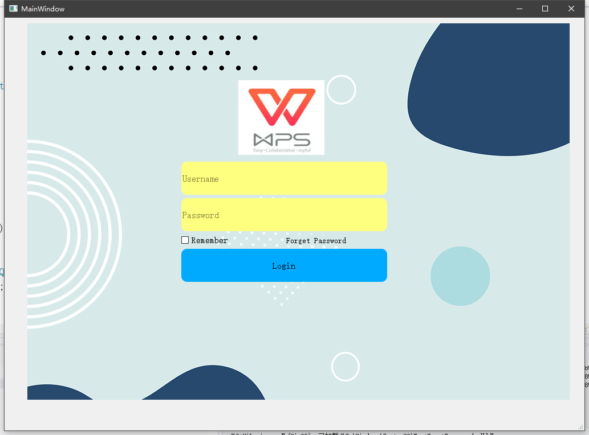
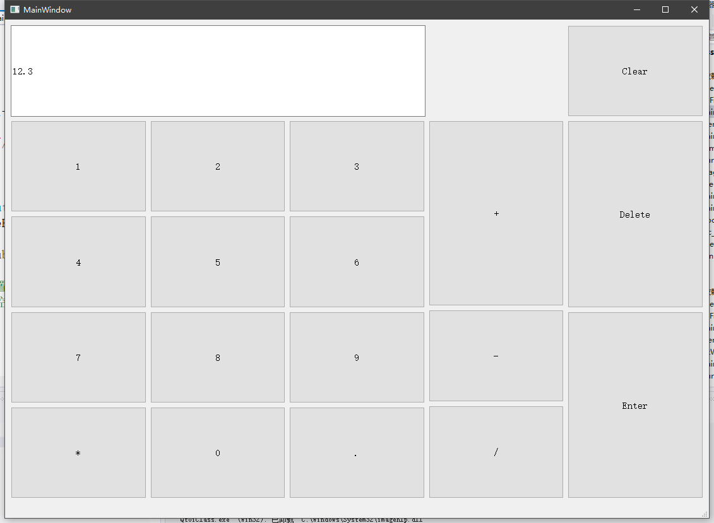
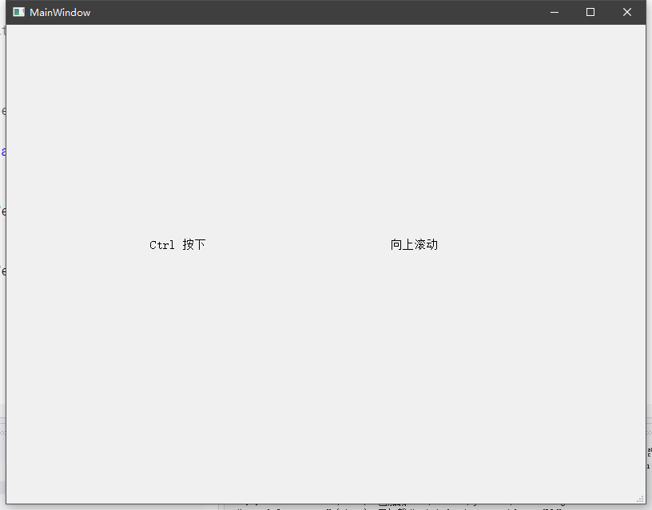

练习1：

实现一个登录界面布局：

效果如下：

练习2：

实现类似 windows 系统的计算器,可以计算表达式

效果如下：

练习3：

- 在界面上创建一个 QLabel 标签

- - 当用户按下 ctrl 键的时候，QLable 标签显示为 "Ctrl press"
  - 当 ctrl 键 松开的时候，QLabel 标签显示为 "Ctrl release"

- 相关重写函数：

void keyPressEvent(QKeyEvent *event);

void KeyReleaseEvent(QKeyEvent *event);

练习4:

- - 在主窗口中拦截滚轮事件，并记录滚动方向和距离，通过 ui 界面进行展示

  - 提示

  - 1. 在eventFilter函数中，检查事件类型是否为QEvent::Wheel。如果是，通过QWheelEvent\获取滚轮事件信息。
    2. 根据QWheelEvent的delta值判断滚动方向，delta大于 0 表示向上滚动，小于 0 表示向下滚动。

这两个练习效果如下：

