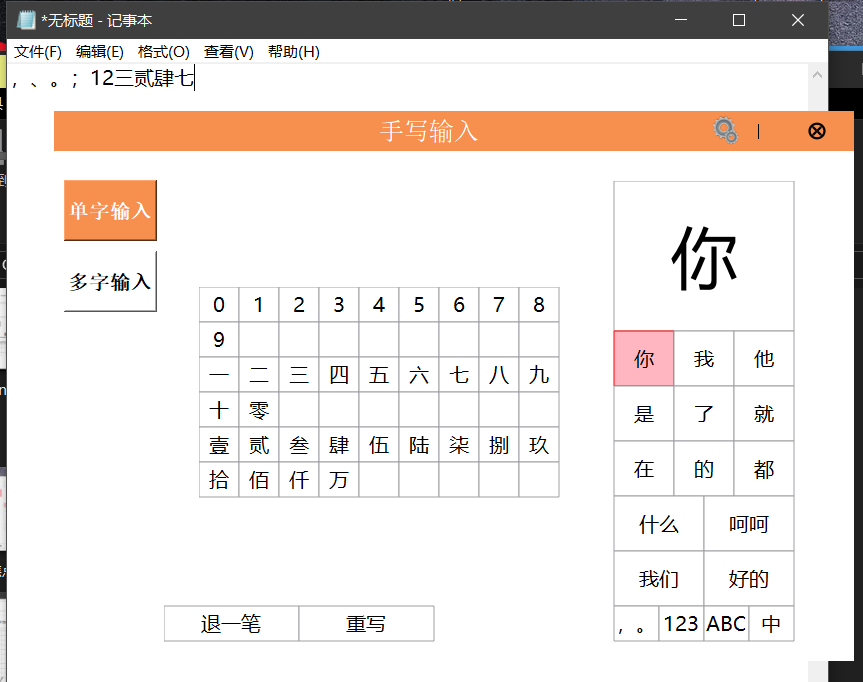

**题目：**

智能手写输入法是一款创新型的文字输入解决方案，它融合了先进的手写识别技术和智能化算法，为用户提供便捷、高效且准确的手写输入体验。

**单字输入识别 ：**UI界面设计(参考搜狗手写) 、 单字识别、 笔画撤销、 重写 **(已完成)**

**非中文输入：** 英文输入，可通过按钮进行切换与选择、 数字输入,可通过按钮切换与选择、 标点符号输入,通过按钮切换与选择 **(已完成)**

**设置界面：** UI 设计、 设置界面入口    **(已完成)**

**需要支持的功能 ：**支持笔迹颜色设置，不少于 5 种颜色 、支持笔迹粗细设置，不少于3种、支持候选字号设置，不少于3种 、支持恢复默认设置 **(已完成)**

**进阶需求说明 ：**

**长句手写输入**，可以连续输入多个汉字  **(已完成)**

**中文联想**，根据上下文和用户习惯，实时提供准确的联想词汇和预测内容，减少用户输入时间，提高输入效率。 **(已完成)**

**中文手写叠加**输入(参考讯飞手写输入法) **(已完成)**

**中英文混合输入**，英文字母手写输入 **(已完成)**

**数字手写识别** **(已完成)**

**===================================界面与功能展示=========================================**

## 界面与测试展示
**本输入法可以在任何其他程序输入框中输入。**


**单字输入识别 ：**UI界面设计(参考搜狗手写) 、 单字识别、 笔画撤销、 重写 **(如下)**


**非中文输入：** 英文输入，可通过按钮进行切换与选择、 数字输入,可通过按钮切换与选择、 标点符号输入,通过按钮切换与选择 **(如下)**





**设置界面：** UI 设计、 设置界面入口    **需要支持的功能    ** 效果展示 **(如下)**


**长句手写输入**


**中文联想与词库展示**


**中文手写叠加**

.png)

**中英文混合输入与数字手写识别**


## 行测试结果展示


**==========================================整体代码思路=============================================**

## 整体代码思路

文件分为：21个文件
　　mainwindow.ui、writewidget.h、writewidget.cpp、smallkeyboardwidget.h、smallkeyboardwidget.cpp、singlewordwidget.h、singlewordwidget.cpp、multiwordwidget.h、multiwordwidget.cpp、writemanager.h、writemanager.cpp、customcontrols.h、customcontrols.cpp、settingwidget.h、settingwidget.cpp、mainwindow.h、mainwindow.cpp、signalcontroller.h、signalcontroller.cpp、main.cpp、lexicon/userLexicon.txt

**writewidget.h、writewidget.cpp**实现了一个自定义的绘图小部件**（WriteWidget）**，允许用户通过鼠标在窗口上绘制路径轨迹。主要功能包括：
    1.绘制鼠标轨迹：实时记录并显示鼠标按下、移动、释放时的轨迹。
    2.保存绘制路径：支持保存多条路径，并以分段方式显示。
    3.绘制背景网格：在绘图窗口上添加可视化网格背景。
    4.发送信号：在鼠标释放时触发信号，通知路径绘制完成。
**smallkeyboardwidget.h、smallkeyboardwidget.cpp**实现了一个小型键盘组件**（SmallKeyboardWidget）**。主要功能包括：
    1.键盘显示：使用矩形网格布局展示按键（6x9）。每个按键通过动态内容填充。
    2.鼠标交互：鼠标悬停时高亮显示按键、鼠标点击时触发选中按键的信号。
    3.动态按键内容设置：支持通过构造函数传入按键内容列表（QStringList）动态配置键盘内容。
**singlewordwidget.h、singlewordwidget.cpp**实现了一个单字候选区的交互式组件 **(SingleWordWidget)**，主要功能包括：
    1.候选字的更新与显示：动态展示通过手写输入或其他方式识别出的候选字。
    2.鼠标交互支持：包括鼠标悬停高亮、点击选中候选字或选项键。
    3.特殊键处理：处理类似键盘切换、重写、退笔等功能。
    4.动态高亮与反馈：根据鼠标操作实时调整候选字和选项的高亮效果，增强用户体验。
**multiwordwidget.h、multiwordwidget.cpp**实现了一个多字候选区的交互式组件 **(MultiWordWidget)**，主要功能包括：
    1.候选字更新与显示：根据输入结果动态展示候选字。
    2.鼠标交互：鼠标悬停时高亮显示候选字和选项按钮、鼠标点击时触发候选字选择或特殊功能键（如切换键盘、退一笔等）。
    3.动态布局：根据候选字长度动态调整布局。
    4.特殊功能键支持：实现键盘切换、清空重写等功能，并通过信号与外部交互。
**writemanager.h、writemanager.cpp**实现了一个手写输入系统中的核心逻辑管理类**(WriteManager)**。主要作用是：
    1.手写笔迹管理：
        >利用 InkManager 管理用户的手写笔迹（添加、删除、重置等操作）。
        >通过捕捉 WriteWidget 的鼠标事件将用户绘制的路径转换为墨迹（Ink Strokes）。
    2.手写识别：
        >调用 UWP 提供的 InkManager 和 InkRecognizerContainer 进行手写识别。
        >支持异步执行识别任务，提高界面响应能力。
    3.联想词与词库管理： 词库**lexicon/userLexicon.txt**
        >根据当前识别的文字生成联想词。
        >管理全局词库（加载、更新、保存），提高手写识别的智能性。
    4.手写操作控制：
        >支持“退一笔”“清空”等操作，用于笔迹管理。
**customcontrols.h、customcontrols.cpp**实现了一些自定义的 GUI 控件，主要包括：
    1.自定义下拉框 LineComboBox：
        >在下拉框中显示具有线宽样式的选项。
        >支持动态绘制选项和当前选中的线条样式。
    2.自定义委托类 LineDelegate：
        >为 LineComboBox 提供自定义绘制逻辑，用于渲染下拉框内的选项。
    3.可交互标签 ClickableLabel：
        >一个可点击的标签，支持鼠标悬停、点击、释放时的动态样式变化。
        >通过信号与外部组件交互。
**settingwidget.h、settingwidget.cpp**实现了一个手写输入法的设置窗口类**(SettingWidget)**，用于调整相关配置选项。它提供了用户自定义的功能，例如颜色、线条粗细、候选字号、单字重叠、识别间隔等设置，并通过信号将设置结果传递到外部。主要功能:
    1.窗口初始化与布局：
        >创建多种控件（按钮、下拉框、自定义控件等）并组织布局。
        >支持颜色、线宽、候选字号等多种设置。
    2.动态交互：
        >支持交互式操作（颜色选择、重置、确认等），并在界面上实时反映更改。
        >模态窗口：阻塞父窗口，确保设置完成后才返回。
    3.状态管理：
        >当前状态（颜色、线宽等）与控件同步，用户修改后可实时更新状态。
        >支持恢复默认设置功能。
    4.信号与槽：
        >提供信号 transferAllStyle，将设置的配置项（颜色、线宽等）传递给外部。
**mainwindow.h、mainwindow.cpp**实现了一个手写输入法的主窗口 **(MainWindow)**，集成了多个功能模块，包括单字输入、多字输入、虚拟键盘以及设置窗口。其主要功能如下
    1.主界面管理:
        >提供单字、多字手写输入的切换功能。
        >集成虚拟键盘（符号、数字、字母）及其动态显示与切换。
        >支持拖动窗口、无标题栏显示以及**重要的窗口不争夺焦点属性设置**。
    2.功能模块集成:
        >管理 WriteWidget（手写输入窗口）、SettingWidget（设置界面）等子组件。 
        >SignalController 管理各模块之间的信号与槽连接。
    3.动态交互:
        >实现模块间的状态同步，例如手写窗口和虚拟键盘的切换。
        >通过按钮触发不同的输入模式和设置界面。
**signalcontroller.h、signalcontroller.cpp**实现了一个信号管理器类**（SignalController）**，用于集中管理和连接手写输入法系统中不同模块之间的信号与槽。其主要作用包括：
    1.模块通信：
         >管理手写输入**（WriteWidget）**、设置**（SettingWidget）**、候选字显示**（SingleWordWidget、MultiWordWidget）**等模块的
    2.信号与槽。
         >集中处理模块间的复杂信号逻辑，简化代码结构。
    3.候选字处理：
         >处理手写识别结果，将候选字更新到界面。
         >处理候选字选择，将选中字发送到输入目标（模拟键盘输入）。
    4.样式与行为设置：
         >通过 **SettingWidget** 修改样式参数（如颜色、线宽、候选字大小等）并同步到相关模块。
    5.虚拟键盘输入：
        >处理虚拟键盘的按键选择，将输入内容通过模拟键盘事件发送到目标窗口。
**main.cpp**定义了 main 函数，用于启动手写输入法应用。

**关系图**

```
+------------------+         +------------------+         +------------------+
|     Model        |         |   Controller     |         |      View         |
+------------------+         +------------------+         +------------------+
| WriteManager     |<------->| SignalController |<------->| MainWindow        |
|                  |         |                  |         | SingleWordWidget  |
|                  |         |                  |         | MultiWordWidget   |
|                  |         |                  |         | WriteWidget       |
|                  |         |                  |         | SmallKeyboardWidget|
|                  |         |                  |         | SettingWidget     |
+------------------+         +------------------+         +------------------+
```

**=======================================WriteWidget类设计====================================**

## WriteWidget类设计

### 设计思路

1. 采用C++和Qt框架，定义了一个`WriteWidget`类，通过继承`QWidget`实现自定义绘图。
2. 事件驱动机制：
   - 重写鼠标事件处理函数（`mousePressEvent`、`mouseMoveEvent`、`mouseReleaseEvent`），处理用户交互。
   - 重写绘图事件（`paintEvent`），以支持路径和背景的绘制。
3. 路径记录：
   - 使用`m_currentPath`存储当前正在绘制的路径。
   - 使用`m_paths`保存历史路径，以便在鼠标释放时存储并渲染。
4. **信号槽机制**：通过信号`upMouseRelease`通知外部组件绘图完成。
5. **绘制优化**：使用`QPainter`启用抗锯齿效果，确保绘图质量。

------

### 流程图

#### 总体流程

```
用户交互（鼠标事件）
        │
        ├── 鼠标按下事件（mousePressEvent）
        │     │
        │     └── 清空m_currentPath，记录起点
        │
        ├── 鼠标移动事件（mouseMoveEvent）
        │     │
        │     └── 追加点到m_currentPath，实时更新
        │
        ├── 鼠标释放事件（mouseReleaseEvent）
        │     │
        │     ├── 将m_currentPath存储到m_paths
        │     ├── 发出信号upMouseRelease
        │     └── 清空m_currentPath
        │
        └── 重绘事件（paintEvent）
              │
              ├── 绘制网格背景
              ├── 绘制历史路径（m_paths）
              └── 绘制当前路径（m_currentPath）
```

------

### 详细模块分析

#### 1. **构造函数**

初始化了绘图相关的属性：

- `m_lineWidth`：笔迹宽度，默认值为3。
- `m_lineColor`：笔迹颜色，默认灰色。
- `m_overlapFlag`：用于标记路径是否重叠，目前未使用。

#### 2. **鼠标事件**

- `mousePressEvent`：
  - 触发条件：鼠标左键按下。
  - 动作：清空当前路径`m_currentPath`，记录起点。
- `mouseMoveEvent`：
  - 触发条件：鼠标左键按下并移动。
  - 动作：将当前位置加入`m_currentPath`，调用`update()`触发重绘。
- `mouseReleaseEvent`：
  - 触发条件：鼠标左键释放。
  - 动作：将当前路径保存到历史路径`m_paths`，发送信号`upMouseRelease`，清空`m_currentPath`。

#### 3. **绘图事件（`paintEvent`）**

- **背景绘制**：绘制带有灰色网格的背景。
- 路径绘制：
  - 历史路径：使用`m_paths`渲染已保存的路径。
  - 当前路径：使用`m_currentPath`实时显示正在绘制的路径。
- **优化**：启用抗锯齿效果提高视觉质量。

**=======================================SingleWordWidget类设计====================================**

## SingleWordWidget类设计

## 设计思路

1. **模块化设计**：
   - 候选字显示与交互：提供 `updateCandidates` 方法更新候选字列表，并使用 `paintEvent` 绘制候选区域。
   - 鼠标交互逻辑：通过重写 `mouseMoveEvent` 和 `mousePressEvent`，处理鼠标悬停和点击事件。
   - 特殊键功能：实现 `handleSpecialKeys`，通过信号与外部通信。
2. **信号槽机制**：
   - `candidateSelected`：点击候选字后发射信号，通知外部候选字的选择。
   - `keyboardSelected`：点击特殊键（如切换到字母键盘）发射信号，通知外部更新键盘状态。
   - `changeInkSelected`：点击“退一笔”或“重写”发射信号，通知外部修改笔迹状态。
3. **分区域绘制**：
   - 通过不同区域划分（候选字区域、特殊键区域），便于绘制逻辑和交互逻辑的独立实现。
4. **动态响应**：
   - 候选字的动态更新：可根据用户输入变化动态调整显示内容。
   - 鼠标的实时反馈：通过实时高亮鼠标悬停的方块，提高交互体验。

------

### 流程图

#### 总体流程

```
用户操作（鼠标事件）
        │
        ├── 鼠标悬停事件（mouseMoveEvent）
        │     │
        │     ├── 检查鼠标是否悬停在候选字方块
        │     ├── 更新高亮状态
        │     └── 重绘候选字区域
        │
        ├── 鼠标点击事件（mousePressEvent）
        │     │
        │     ├── 点击候选字方块：发送候选字信号
        │     └── 点击选项键：处理特殊键并发送信号
        │
        └── 绘制事件（paintEvent）
              │
              ├── 绘制候选字区域
              ├── 绘制候选字方块及文字
              └── 绘制特殊选项区域
```

------

### 详细模块分析

#### 1. **候选字更新与显示**

- **`updateCandidates` 方法**：
  - 根据是否联想（`associate`）和传入的候选字列表更新显示内容。
  - 将候选字分为单字（最多9个）和多字（最多4个）显示，确保显示布局简洁美观。
  - 调用 `update` 方法局部刷新候选字区域。
- **绘制候选字区域**：
  - 候选字区域分为两部分：
    1. **单字部分**：以 3x3 的网格布局展示。
    2. **多字部分**：以 2x2 的网格布局展示。
  - 使用 `drawBlock` 方法绘制方块及文字。

#### 2. **鼠标事件**

- **`mouseMoveEvent`**：
  - 检查鼠标是否悬停在候选字或选项区域。
  - 更新悬停的方块及文字，并触发局部重绘。
- **`mousePressEvent`**：
  - 判断鼠标点击是否在候选字或选项区域：
    - 候选字区域：发送 `candidateSelected` 信号。
    - 选项区域：调用 `handleSpecialKeys` 处理特殊键。

#### 3. **特殊键处理**

- `handleSpecialKeys` 方法：
  - 通过键值判断触发不同功能：
    - 符号、数字、字母键盘切换：发送 `keyboardSelected` 信号。
    - “退一笔”/“重写”：发送 `changeInkSelected` 信号。

#### 4. **绘制与高亮效果**

- `drawBlock` 方法：
  - 绘制方块时根据是否高亮调整样式：
    - 高亮方块：红色边框，淡粉红背景。
    - 普通方块：灰色边框，白色背景。

------

### 流程与布局

#### 布局说明

1. **候选字区域**：
   - **显示选中字**：顶部高亮展示当前悬停的文字。
   - **单字候选字**：3x3 网格布局。
   - **多字候选字**：2x2 网格布局。
2. **选项区域**：
   - 左下角显示特殊选项键（如切换键盘、退一笔等）。

#### 流程

1. **初始化**：
   - 设置默认候选字列表与窗口布局。
   - 启用鼠标追踪功能。
2. **用户交互**：
   - 鼠标悬停更新高亮状态。
   - 鼠标点击触发候选字选择或特殊键操作。
3. **动态更新**：
   - 根据外部输入动态调整候选字内容，并刷新显示。

**=======================================MultiWordWidget类设计====================================**

## MultiWordWidget类设计

### 设计思路

1. **动态候选字更新**：
   - 通过 `updateCandidates` 方法更新候选字列表，支持动态调整显示内容。
   - 候选字以平铺方式布局，长短字动态调整宽度。
2. **分区域绘制**：
   - 候选字区域：显示手写识别结果。
   - 特殊键区域：显示额外操作选项，如切换键盘、清除等。
3. **鼠标交互**：
   - 鼠标悬停高亮方块，并实时更新界面。
   - 鼠标点击触发对应候选字选择或特殊键动作。
4. **信号槽机制**：
   - `candidateSelected`：选择候选字时触发。
   - `keyboardSelected`：点击特殊键切换键盘类型时触发。
   - `changeInkSelected`：选择清除或重写功能时触发。

------

### 流程图

#### 总体流程

```
用户交互（鼠标事件）
        │
        ├── 鼠标悬停事件（mouseMoveEvent）
        │     ├── 检查鼠标是否悬停在候选字区域
        │     ├── 更新高亮状态
        │     └── 局部重绘候选字或选项区域
        │
        ├── 鼠标点击事件（mousePressEvent）
        │     ├── 检查鼠标是否点击候选字区域
        │     ├── 点击候选字：发送信号 candidateSelected
        │     └── 点击选项键：触发特殊键动作，发送相关信号
        │
        └── 绘制事件（paintEvent）
              ├── 绘制候选字区域
              └── 绘制选项键区域
```

------

### 详细模块分析

#### 1. **候选字更新与显示**

- **`updateCandidates` 方法**：
  - 清空候选字列表，重新填充内容。
  - 按照候选字长度动态调整平铺布局，确保不同长度的候选字占用合适的宽度。
  - 调用 `update` 方法局部刷新候选字区域。
- **绘制候选字区域**：
  - 遍历候选字列表，将每个候选字绘制在一个动态宽度的方块内。
  - 方块宽度根据候选字长度计算：`cellWidth * 0.5 * (text.size() + 1)`。

#### 2. **鼠标交互**

- **`mouseMoveEvent`**：
  - 遍历候选字和选项区域，检查鼠标是否悬停。
  - 更新高亮的候选字或选项方块，并局部重绘。
- **`mousePressEvent`**：
  - 检查鼠标点击是否命中候选字或选项方块：
    - 候选字：触发 `candidateSelected` 信号。
    - 选项方块：调用 `handleSpecialKeys` 处理特殊功能。

#### 3. **特殊功能键支持**

- **`handleSpecialKeys` 方法**：
  - 通过键值匹配触发不同功能：
    - 切换键盘（符号、数字、字母键盘等）。
    - 清除当前笔迹（退一笔、重写）。
- **特殊键布局**：
  - 左下角 1x4 和 2x1 的布局展示 6 个选项键。

#### 4. **绘制与高亮效果**

- `drawBlock` 方法：
  - 根据是否高亮动态调整样式：
    - 高亮：红色边框，淡粉红背景。
    - 普通：灰色边框，白色背景。
  - 在方块中央绘制文字。

------

### 布局说明

1. **候选字区域**：
   - 水平平铺，动态调整宽度。
   - 支持显示长短不一的候选字。
2. **特殊键区域**：
   - 左下角显示 6 个特殊功能键，包括符号、数字、字母切换和清除操作。

**=====================================SmallKeyboardWidget类设计==================================**

## SmallKeyboardWidget类设计

### 设计思路

1. **动态键盘内容**：
   - 按键内容通过构造函数传入，并动态生成对应的方块布局。
   - 每个按键方块的尺寸固定，整体布局为 6 行 9 列。
2. **鼠标交互**：
   - 鼠标悬停时实时检测并高亮对应按键。
   - 鼠标点击后发送信号，通知外部按键被选中。
3. **分区域绘制**：
   - 候选字区域：按键通过方块绘制。
   - 高亮效果：悬停时方块边框和背景颜色动态变化。

------

### 流程图

#### 总体流程

```
用户交互（鼠标事件）
        │
        ├── 鼠标悬停事件（mouseMoveEvent）
        │     ├── 遍历按键区域，检查鼠标是否悬停
        │     ├── 更新高亮按键
        │     └── 触发界面重绘
        │
        ├── 鼠标点击事件（mousePressEvent）
        │     ├── 遍历按键区域，检查鼠标是否点击
        │     ├── 若点击有效按键，发送信号 candidateSelected
        │     └── 输出调试信息（可定制）
        │
        └── 绘制事件（paintEvent）
              ├── 绘制按键方块
              ├── 绘制文字
              └── 绘制高亮效果（如有）
```

------

### 详细模块分析

#### 1. **键盘内容配置**

- 构造函数：
  - 默认构造函数初始化键盘区域为固定大小（370x220）。
  - 支持传入按键内容列表，通过 `items` 动态填充。

#### 2. **绘制键盘区域**

- `paintEvent` 方法：
  - 按照 6x9 的网格布局绘制键盘按键。
  - 每个按键方块的宽高固定为 40x35。
  - 调用 `drawBlock` 方法完成方块绘制及文字居中显示。

#### 3. **鼠标交互**

- **`mouseMoveEvent` 方法**：
  - 检查鼠标是否悬停在按键方块内。
  - 若悬停有效按键，更新高亮状态并触发界面重绘。
- **`mousePressEvent` 方法**：
  - 检查鼠标是否点击有效按键。
  - 点击后发送 `candidateSelected` 信号，传递按键内容。

#### 4. **绘制与高亮效果**

- `drawBlock` 方法：
  - 普通方块：白色背景，灰色边框。
  - 高亮方块：淡粉红背景，红色边框。
  - 方块内文字居中显示，字体为微软雅黑。

------

### 布局说明

#### 1. **按键区域**

- 共 6 行 9 列，最大支持 54 个按键。
- 按键尺寸固定（40x35），通过内容列表动态填充。

#### 2. **交互区域**

- 鼠标悬停与点击事件限定在键盘区域内。
- 按键高亮与选中通过动态更新界面反馈。

------

### 信号槽设计

1. `candidateSelected` 信号：
   - 鼠标点击按键后触发，传递选中按键的内容。
   - 可用于外部模块接收按键输入。

**======================================WriteManager类设计====================================**

## WriteManager类设计

### 设计思路

1. **模块化设计**：
   - **手写笔迹处理**：管理笔迹的添加、删除、重置等操作。
   - **手写识别**：调用异步任务处理墨迹识别，并发出信号更新界面。
   - **联想词管理**：从词库中筛选匹配的联想词，并通过信号通知外部。
   - **词库管理**：加载和保存用户词库，支持动态调整。
2. **异步处理**：
   - 使用 `QtConcurrent::run` 和 `QFutureWatcher` 实现异步手写识别与联想词查询，避免阻塞主线程。
3. **UWP 集成**：
   - 通过 UWP 的 `InkManager` 和 `InkRecognizerContainer` 提供底层的手写笔迹管理和识别功能。
4. **信号槽机制**：
   - 利用信号通知外部系统手写识别结果和联想词更新。

------

### 流程图

#### 总体流程

```
用户手写操作
        │
        ├── 鼠标事件（`WriteWidget`）
        │     ├── 鼠标释放时信号触发
        │     └── 调用 `upCurrentPathToInkManagerAndRecognize`
        │
        ├── 笔迹处理
        │     ├── 添加路径到 `InkManager`
        │     └── 调用异步识别任务
        │
        ├── 手写识别（异步）
        │     ├── 调用 `InkRecognizerContainer.RecognizeAsync`
        │     └── 返回识别结果，通过信号通知界面
        │
        ├── 联想词查询（异步）
        │     ├── 从词库筛选匹配词
        │     └── 返回联想词，通过信号通知界面
        │
        └── 界面更新
              ├── 显示识别结果
              └── 更新联想词列表
```

------

### 详细模块分析

#### 1. **手写笔迹管理**

- **墨迹添加**：
  - `upCurrentPathToInkManagerAndRecognize`：将用户手写路径转换为 `InkPoint`，并添加到 `InkManager`。
  - 支持处理重叠输入，通过偏移量 `movePx` 和计时器 `divideTimer` 实现。
- **删除与重置**：
  - `undoLastStroke`：删除最后一笔。
  - `resetInkManager`：重置所有笔迹。

#### 2. **手写识别**

- **异步识别**：
  - `recognizeInkAsync`：调用 `InkRecognizerContainer` 的 `RecognizeAsync` 方法，异步执行识别任务。
  - 返回多种候选结果，通过信号 `recognitionFinished` 通知外部。
- **容错处理**：
  - 如果没有识别器可用或识别失败，返回默认候选词。
```
//异步识别核心代码：
InkRecognizerContainer recognizerContainer;
auto recognizers = recognizerContainer.GetRecognizers();// 获取手写识别器

// 使用 QtConcurrent 异步运行 RecognizeAsync
QFuture<QStringList> future = QtConcurrent::run([=]() -> QStringList {
    QStringList recognizedWords;
    try {
        auto results = m_inkManager.RecognizeAsync(InkRecognitionTarget::All).get();
        if (results.Size() == 0) {
            return recognizedWords;
        }
        for (const auto& result : results) {
            auto candidates = result.GetTextCandidates();
            for (const auto& candidate : candidates) {
                recognizedWords << QString::fromStdWString(candidate.c_str());
            }
        }
        return recognizedWords;
    }
    catch (const winrt::hresult_error& e) {
        recognizedWords << "Recognition failed: " + QString::fromStdWString(e.message().c_str());
        return recognizedWords;
    }
    });

// 使用 QFutureWatcher 监听异步结果
QFutureWatcher<QStringList>* watcher = new QFutureWatcher<QStringList>(this);
connect(watcher, &QFutureWatcher<QStringList>::finished, this, [=]() {
    QStringList result = watcher->result();
    emit recognitionFinished(false, result);  // 通过信号通知结果
    watcher->deleteLater();
    });

watcher->setFuture(future);
```

#### 3. **联想词管理**

- **联想词查询**：
  - `associateAsync`：从全局词库中筛选匹配的联想词，支持异步操作。
  - 返回匹配的前 8 个候选词，通过信号通知界面。
- **词频更新**：
  - `updateWordFrequency`：动态更新词库的词频，提高常用词的优先级。

```
// 异步获取联想词方法
void WriteManager::associateAsync(const QString& currentWord) {
    // 启动异步任务
    QtConcurrent::run([=]() {
        QStringList recognizedWords;

        //  从内存中的 wordMap 查询匹配字段
        for (const auto& [frequency, word] : m_wordMap) {
            if (word.startsWith(currentWord)) {
                recognizedWords.append(word.mid(currentWord.size()));//显示时排除已选字
                if (recognizedWords.size() >= 8) break; // 限制最多 8 个结果
            }
        }

        //  发射信号
        emit recognitionFinished(true, recognizedWords);
        });
}
//对词库更新
void WriteManager::updateWordFrequency(const QString& word) {
    // 查找是否已有词条
    for (auto it = m_wordMap.begin(); it != m_wordMap.end(); ++it) {
        if (it->second == word) {
            int newFrequency = it->first + 1; // 增加频率
            m_wordMap.erase(it); // 删除旧词条
            m_wordMap.emplace(newFrequency, word); // 插入更新后的词条
            qDebug() << "Succeed update WordMap !";
            return;
        }
    }
    // 如果词不存在，则新增
    m_wordMap.emplace(1, word); // 初始频率为 1

    qDebug() << "Succeed add WordMap !";
}
```

#### 4. **词库管理**

- **加载词库**：
  - `initializeWordMap`：从文件加载用户词库，并存储为 `std::multimap` 以支持按频率排序。
- **保存词库**：
  - `saveUpdatedWordsToFile`：在析构时将更新后的词库保存到文件，确保用户数据持久化。
```
//初始化词库
void WriteManager::initializeWordMap(const QString& filePath) {
    QFile file(filePath);
    if (file.open(QIODevice::ReadOnly | QIODevice::Text)) {
        QTextStream stream(&file);
        // 设置编码为 UTF-8
        stream.setCodec("UTF-8");
        while (!stream.atEnd()) {
            QString line = stream.readLine().trimmed();
            QStringList parts = line.split(':');
            if (parts.size() == 2) {
                QString word = parts[0];
                int frequency = parts[1].toInt();
                m_wordMap.emplace(frequency, word);
            }
        }
        file.close();
        qDebug() << "WordMap initialized with" << m_wordMap.size() << "entries.";
    }
    else {
        qDebug() << "Failed to open file for initialization:" << filePath;
    }
}
//保存更新内容
void WriteManager::saveUpdatedWordsToFile(const QString& filePath) {
    QFile file(filePath);
    if (file.open(QIODevice::WriteOnly | QIODevice::Text)) {
        QTextStream stream(&file);
        stream.setCodec("UTF-8"); // 设置输出为 UTF-8 编码

        size_t count = 0; // 计数器
        for (const auto& word : m_wordMap) {
            if (count >= 50000) break; // 超过 50000 次时退出循环
            stream << word.second << ":" << word.first << "\n";
            ++count;
        }
        file.close();
        qDebug() << "Updated words saved to file.";
    }
    else {
        qDebug() << "Failed to open file for saving:" << filePath;
    }
}
```
------

### 信号槽设计

1. **`recognitionFinished`**：
   - 手写识别完成后触发，通知界面更新识别结果。
2. **`upMouseRelease`**：
   - 鼠标释放后触发，将路径转换为墨迹并启动识别任务。

**====================================自定义的 GUI 控件设计=================================**

## 自定义的 GUI 控件设计

### 设计思路

1. **自定义绘制功能**：
   - 使用 `QStyledItemDelegate` 和 `QComboBox` 实现 `LineComboBox`，以支持选项和当前显示内容的自定义绘制。
   - 绘制的重点是根据选项的线宽绘制线段。
2. **交互式控件**：
   - `ClickableLabel` 支持鼠标事件（悬停、点击、释放）动态更新边框样式，并通过信号机制与外部通信。
3. **模块化设计**：
   - 每个类独立实现其特定功能，易于扩展和复用。

------

### 流程图

#### `LineComboBox` 工作流程

```
用户操作（选择或查看选项）
        │
        ├── 下拉框展开
        │     ├── 调用委托类 `LineDelegate` 绘制每个选项
        │     └── 根据选项的线宽绘制线段
        │
        ├── 用户选择选项
        │     ├── 更新当前选项索引
        │     └── 触发重绘，调用 `paintEvent`
        │
        └── 下拉框关闭
              └── 显示选中的线段样式
```

#### `ClickableLabel` 工作流程

```
用户交互（鼠标事件）
        │
        ├── 鼠标悬停
        │     ├── 更新样式表，设置黑色边框
        │     └── 重绘组件
        │
        ├── 鼠标点击
        │     ├── 发出信号 `clicked`
        │     └── 更新样式表，显示点击状态
        │
        └── 鼠标释放
              └── 如果未保持高亮，恢复透明边框
```

------

### 详细模块分析

#### 1. **自定义委托类 `LineDelegate`**

- **功能**：
  - 为 `QComboBox` 提供自定义绘制功能。
  - 根据选项的 `UserRole` 数据绘制不同线宽的线段。
- **方法**：
  - `paint`：获取选项的线宽并绘制线段。
  - `sizeHint`：定义选项的高度（固定为 20 像素）。

#### 2. **自定义下拉框 `LineComboBox`**

- **功能**：
  - 展示具有线宽样式的选项列表。
  - 当前选中的选项在控件内动态绘制。
- **方法**：
  - `paintEvent`：根据当前选中项绘制线段，同时绘制下拉箭头。
- **数据管理**：
  - 使用 `QComboBox` 的 `Qt::UserRole` 存储每个选项的线宽。

#### 3. **可交互标签 `ClickableLabel`**

- **功能**：
  - 支持鼠标悬停、点击和释放的动态样式变化。
  - 鼠标点击时发出 `clicked` 信号，便于外部响应。
- **方法**：
  - `mousePressEvent`：鼠标点击时设置黑色边框并触发信号。
  - `mouseReleaseEvent`：鼠标释放时恢复默认样式（如果未保持高亮）。
  - `enterEvent`/`leaveEvent`：鼠标悬停和离开时动态更新边框样式。
- **样式表更新**：
  - `updateStyle`：解析并合成新的样式表，保留背景样式。

**====================================SettingWidget类设计==================================**

## SettingWidget类设计

### 设计思路

1. **模块化设计**：
   - 通过 `initWindowLayout` 初始化所有控件。
   - 用 `feedbackStatusLink` 链接信号和槽，实现控件的动态交互。
2. **状态同步**：
   - 内部维护一个状态对象（包括颜色索引、线宽、字号等）。
   - 每次操作后更新状态对象并同步到界面控件。
3. **用户交互友好性**：
   - 提供实时反馈（例如点击颜色按钮时更新线条颜色）。
   - 支持默认值恢复，防止误操作导致无法撤销。
4. **自定义控件**：
   - 使用 `LineComboBox` 显示线宽样式。
   - 使用 `ClickableLabel` 提供颜色选择的交互体验。

------

### 流程图

#### 总体流程

```
用户打开设置窗口
        │
        ├── 初始化布局和控件状态
        │
        ├── 用户交互
        │     ├── 修改设置（颜色、线宽、字号等）
        │     ├── 恢复默认设置
        │     └── 确认并关闭窗口
        │
        ├── 更新状态
        │     ├── 当前状态对象同步到控件
        │     └── 发出 `transferAllStyle` 信号通知外部
        │
        └── 关闭窗口，返回父窗口
```

------

### 详细模块分析

#### 1. **初始化与布局**

- `initWindowLayout` 方法：
  - 创建所有控件（颜色选择、线宽下拉框、字号下拉框、按钮等）。
  - 通过布局将控件组织在界面中。
  - 设置控件的初始样式和选项，例如：
    - 候选字号有小（12）、中（14）、大（16）三种。
    - 线宽选项为 3、5、8。
    - 颜色选项提供 5 种预定义颜色。

#### 2. **动态交互**

- **颜色选择**：
  - 点击颜色 `ClickableLabel` 时，高亮当前选中的颜色，并同步到线宽下拉框。
  - 每次点击后触发更新，确保只有一个颜色为选中状态。
- **确认与恢复**：
  - 确认按钮：
    - 获取当前设置的所有状态值，并通过信号通知外部。
    - 同时关闭设置窗口。
  - 恢复按钮：
    - 将所有控件恢复到默认值。
    - 更新界面显示并通知外部默认状态。

#### 3. **状态管理**

- **当前状态对象**：
  - 包括颜色、线宽、字号、是否开启单字重叠等设置。
  - 所有操作均基于状态对象，确保数据一致性。
- **状态更新**：
  - **实时更新**：每次用户操作（如颜色选择）后立即更新状态对象。
  - **同步界面**：调用 `updataCurrentStatus` 方法，将状态对象的值同步到控件。

#### 4. **信号与槽**

- **信号 `transferAllStyle`**：
  - 参数：当前颜色、线宽、字号、重叠标志、识别间隔。
  - 用于将用户配置传递到外部模块，触发功能更新。
- **槽连接**：
  - 颜色选择、确认按钮、恢复按钮等均通过槽函数实现动态交互。

------

### 控件说明

1. **`ClickableLabel`（颜色选择按钮）**：
   - 提供颜色选择功能，支持点击高亮和动态更新边框样式。
2. **`LineComboBox`（线宽选择下拉框）**：
   - 显示线宽样式，用户选择后自动更新状态对象。
3. **其他标准控件**：
   - 按钮：确认与恢复默认。
   - 下拉框：候选字号和识别间隔。

**======================================MainWindow类设计===================================**

## MainWindow类设计

### 功能详解

#### 1. 主界面布局

- 主窗口固定大小为 800x550，白色背景并设置不抢夺焦点属性。
- 包含以下核心模块：
  - **单字输入窗口** (`SingleWordWidget`)：用于显示单字候选词及手写输入区域。
  - **多字输入窗口** (`MultiWordWidget`)：用于多字候选词展示和手写输入。
  - **手写输入区域** (`WriteWidget`)：用户手写输入的主要区域。
  - **小键盘** (`SmallKeyboardWidget`)：包括符号键盘、数字键盘、字母键盘。
  - **设置窗口** (`SettingWidget`)：提供输入法相关配置选项。

设置不抢夺焦点属性：使用了Windows API来修改一个窗口的扩展样式属性，目的是为了确保窗口在显示时不会被激活并始终保持在最顶层。
```
    // 设置扩展样式，防止窗口激活
    HWND hwnd = reinterpret_cast<HWND>(winId());//这一行声明一个 HWND（一个用于标识窗口的句柄）变量，并将其初始化为当前窗口的ID转换成 HWND 类型。winId() 方法通常返回当前窗口的句柄标识，是特定于平台的（在Windows上，它是一个 HWND）。使用 reinterpret_cast 是为了确保类型安全的转换。
    SetWindowLong(hwnd, GWL_EXSTYLE,
        GetWindowLong(hwnd, GWL_EXSTYLE) | WS_EX_NOACTIVATE | WS_EX_TOPMOST);//这行代码调用 SetWindowLong 函数，用来设置窗口的一个属性。具体来说，这里修改的是窗口的扩展样式（GWL_EXSTYLE）。
GetWindowLong(hwnd, GWL_EXSTYLE) 获取当前窗口的扩展样式值。WS_EX_NOACTIVATE 样式防止窗口在被创建或改变时自动成为激活窗口，WS_EX_TOPMOST 使窗口保持在所有非顶层窗口之上，即使窗口未激活也始终处于最顶层。
最后，将这个新的样式值设置回窗口，从而改变窗口的行为。
```

------

#### 2. 信号与槽

- **`currentWidgetConnect` 方法**：
  - 连接按钮与功能槽函数，控制界面交互：
    - 删除待输入框最后一个字符。
    - 切换单字输入、多字输入界面。
    - 切换小键盘类型（符号、数字、字母）。
    - 打开设置窗口并更新状态。
- **小键盘切换逻辑**：
  - 根据用户选择的键盘类型，显示对应的小键盘界面。
  - 如未选择键盘类型，显示手写输入区域。
- **设置功能**：
  - 调用 `SettingWidget` 的方法显示当前状态。
  - 接收用户设置的状态值并应用到输入法。

------

#### 3. 各模块初始化

- **单字与多字输入模块**：
  - 初始化 `SingleWordWidget` 和 `MultiWordWidget` 并添加到 `QStackedWidget`。
  - 默认显示单字输入界面，手写输入区域嵌入其中。
- **小键盘**：
  - 使用 `SmallKeyboardWidget` 初始化符号键盘、数字键盘、字母键盘。
  - 通过 `QStackedWidget` 切换小键盘类型。
- **设置窗口**：
  - 调用 `SettingWidget` 提供用户自定义配置功能。
- **信号控制器**：
  - 使用 `SignalController` 管理模块间信号，简化信号与槽的连接。

------

### 流程图

```
启动应用程序
       │
       ├── 初始化主窗口布局
       │     ├── 设置窗口不抢夺焦点属性
       │     ├── 初始化单字、多字输入模块
       │     ├── 初始化小键盘与手写输入模块
       │     └── 初始化设置窗口
       │
       ├── 用户交互
       │     ├── 切换单字/多字输入界面
       │     ├── 切换小键盘类型
       │     ├── 删除待输入框内容
       │     └── 打开设置窗口
       │
       │
       └── 关闭应用程序
             └── 注销全局热键
```

------

### 类与模块的关系

#### 主界面模块

| **模块**              | **说明**                                         |
| --------------------- | :----------------------------------------------- |
| `MainWindow`          | 主界面窗口，负责整体布局与功能交互。             |
| `SingleWordWidget`    | 单字输入界面，显示候选字并支持手写输入。         |
| `MultiWordWidget`     | 多字输入界面，显示候选词并支持手写输入。         |
| `WriteWidget`         | 手写输入区域，捕捉用户笔迹并发送到后台管理模块。 |
| `SmallKeyboardWidget` | 小键盘模块，包含符号、数字、字母三种键盘。       |
| `SettingWidget`       | 设置窗口，提供颜色、字号等配置选项。             |

**===================================SignalController类设计=================================**

## SignalController类设计

- - ### 主要功能模块
  
    #### 1. **信号连接管理**
  
    - **候选字更新**：
      - 将 `WriteManager` 的识别结果信号 `recognitionFinished` 连接到 `SingleWordWidget` 和 `MultiWordWidget` 的候选字更新槽函数。
    - **候选字选中**：
      - 将 `SingleWordWidget` 和 `MultiWordWidget` 的 `candidateSelected` 信号连接到模拟键盘输入槽函数，并触发联想词功能。
    - **手写操作**：
      - 连接单字、多字手写页面的“退一笔”和“重写”信号到 `WriteManager` 的相应操作槽函数。
  
    #### 2. **虚拟键盘管理**
  
    - 键盘候选字输入：
      - 连接虚拟键盘的 `candidateSelected` 信号到模拟键盘输入槽函数，实现键盘字符输入功能。
  
    #### 3. **设置管理**
  
    - **获取当前配置**：
      - 在打开设置界面时，将当前的笔迹颜色、粗细等状态同步到 `SettingWidget`。
    - **应用配置**：
      - 将 `SettingWidget` 的 `transferAllStyle` 信号连接到手写窗口和候选字模块，用于更新样式和配置。
  
    #### 4. **模拟键盘输入**
  
    - **功能**：
      - 接收输入的文本，通过 `SendInput` 将其模拟为键盘输入发送到目标窗口。
    - **实现**：
      - 遍历输入字符，每个字符发送按下和释放事件。
```
// 模拟键盘输入
void SignalController::sendKeystrokes(const QString& text) {//这是 sendKeystrokes 方法的定义，接收一个 QString 类型的参数 text，该参数包含要模拟输入的文本。
    if (text.isEmpty())return;
    for (const QChar& ch : text) {//使用范围基于的for循环遍历字符串中的每一个字符。
        INPUT input = { 0 };//声明并初始化一个 INPUT 结构，这是Windows API用来描述一个事件（鼠标、键盘或硬件事件）的结构体。{ 0 } 初始化将所有成员设置为零。
        input.type = INPUT_KEYBOARD;//设置输入事件类型为键盘输入
        input.ki.wVk = 0; // 设置虚拟键码（wVk）为0。这里表示不使用虚拟键码，因为我们将使用Unicode字符代码。
        input.ki.wScan = ch.unicode(); // 设置键盘扫描码为当前字符的Unicode值。ch.unicode() 获取 QChar 对象的Unicode编码。
        input.ki.dwFlags = KEYEVENTF_UNICODE; // 设置事件标志为 KEYEVENTF_UNICODE，告诉系统这是一个Unicode字符。
        SendInput(1, &input, sizeof(INPUT));//调用 SendInput 函数发送定义好的键盘输入事件。这个调用模拟按下键盘上的一个键。

        // 释放按键
        input.ki.dwFlags = KEYEVENTF_UNICODE | KEYEVENTF_KEYUP;//修改事件标志以包括 KEYEVENTF_KEYUP，表示键盘按键被释放。
        SendInput(1, &input, sizeof(INPUT));//再次调用 SendInput 发送键盘释放事件。这个调用模拟松开键盘上的键。
        QThread::msleep(10); // 这个延迟是为了确保字符输入不会因为过快发送而丢失，尤其是在连续快速输入时。
    }
}
```

    ------
      
    ### 设计思路
      
    1. **模块解耦**：
       - 将各模块的信号与槽连接抽象到 `SignalController` 中，简化主窗口逻辑并提高可维护性。
    2. **统一信号管理**：
       - 使用 `SignalController::connectControll` 方法集中管理所有信号连接，便于扩展和调试。
    3. **用户交互流畅性**：
       - 使用联想功能和模拟键盘输入提升用户体验。
       - 实现“退一笔”“重写”等功能，便于手写输入修正。
      
    ------
      
    ### 流程图
      
    #### 总体流程
      
    ```
         用户操作
            │
            ├── 手写输入（WriteWidget）
            │     ├── 鼠标事件触发手写识别
            │     └── `recognitionFinished` 信号更新候选字
            │
            ├── 候选字选择（SingleWordWidget/MultiWordWidget）
            │     ├── `candidateSelected` 信号触发联想词查询
            │     └── 更新联想词库
            │
            ├── 虚拟键盘输入（SmallKeyboardWidget）
            │     └── `candidateSelected` 信号模拟键盘输入
            │
            ├── 设置界面（SettingWidget）
            │     ├── 更新当前配置并显示
            │     └── `transferAllStyle` 信号应用设置
            │
            └── 模拟键盘输入
                  └── `sendKeystrokes` 方法发送字符到目标窗口
    ```
      
    ------
      
    ### 详细模块分析
      
    #### 1. **候选字管理**
      
    - **候选字更新**：
      - 根据 `recognitionFinished` 信号的候选字列表更新单字和多字手写界面。
      - 区分是否为联想词，更新显示内容。
    - **候选字选择**：
      - 用户选中候选字后：
        - 模拟键盘输入。
        - 触发联想词查询。
        - 更新词频（非联想词时）。
      
    #### 2. **虚拟键盘管理**
      
    - **信号连接**：
      - 为每种虚拟键盘类型（符号、数字、字母）连接候选字选中信号到模拟键盘输入槽函数。
    - **动态切换**：
      - 通过 `SmallKeyboardWidget` 的信号触发不同键盘布局的切换。
      
    #### 3. **手写操作管理**
      
    - “退一笔”与“重写”：
      - 将手写界面的操作按钮信号连接到 `WriteManager`，实现对应的墨迹操作。
      
    #### 4. **设置管理**
      
    - **状态同步**：
      - 在设置窗口显示前，将当前的笔迹颜色、线宽、候选字号等状态同步到 `SettingWidget`。
    - **应用设置**：
      - 用户更改设置后，通过信号更新手写窗口和候选字模块的样式。
      
    #### 5. **模拟键盘输入**
      
    - **功能**：
      - 通过 `SendInput` 模拟键盘输入。
      - 支持 Unicode 字符输入，适应多语言环境。
    - **实现**：
      - 遍历输入文本，将每个字符分别发送按下和释放事件。

**=======================================main函数设计====================================**

## main函数设计

### 功能详解

1. **应用程序初始化**：
   - 使用 `QApplication` 创建应用程序对象。
   - 传入命令行参数，初始化 Qt 的事件循环。
2. **创建主窗口**：
   - 实例化 `MainWindow` 对象，这是应用程序的主界面。
   - 调用 `show` 方法显示主窗口。
3. **进入事件循环**：
   - 调用 `app.exec()` 开始事件循环，等待用户操作。
   - 程序在事件循环中处理事件（如鼠标点击、键盘输入等），直到用户关闭窗口或调用 `exit`。

------

### 流程图

```
程序启动
    │
    ├── 创建 `QApplication` 实例
    │
    ├── 创建 `MainWindow` 实例
    │     └── 调用 `MainWindow::show` 显示窗口
    │
    ├── 进入事件循环
    │     ├── 等待用户事件
    │     ├── 处理用户交互（如鼠标点击、键盘输入）
    │     └── 更新界面
    │
    └── 程序退出
```